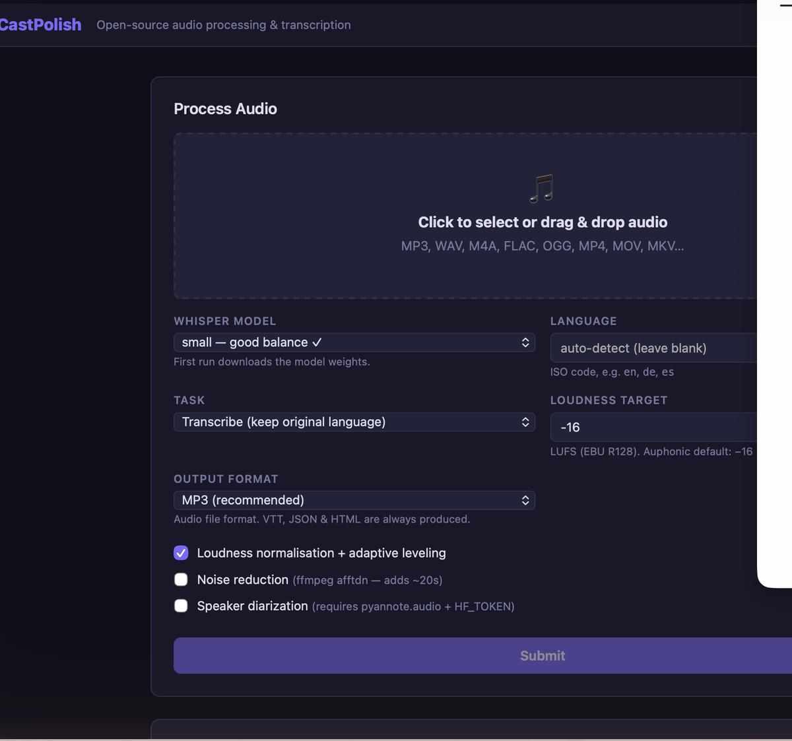
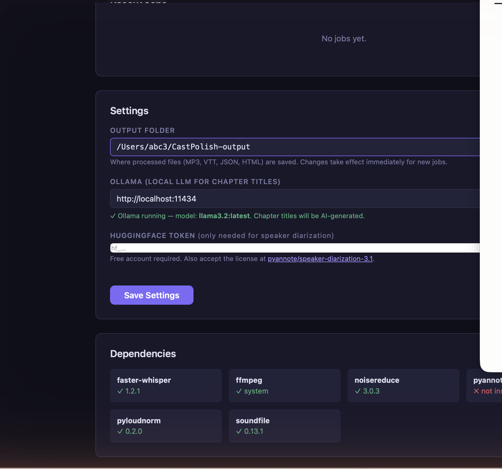

# CastPolish

A local, open-source alternative to Auphonic for podcast and audio post-production. CastPolish runs entirely on your Mac — no cloud, no subscription, no audio ever leaves your machine.

  




---

## What it does

- **Audio processing** — highpass filter, compression, limiting, and two-pass EBU R128 loudness normalization (targets −16 LUFS, podcast standard)
- **Noise reduction** — optional ffmpeg `afftdn` FFT noise reduction (checkbox in UI)
- **Transcription** — [faster-whisper](https://github.com/guillaumekientz/faster-whisper) with word-level timestamps, exported as HTML, WebVTT captions, and Auphonic-compatible JSON
- **AI shownotes** — chapter titles, long summary, brief summary, and suggested tags via [Ollama](https://ollama.com) (local LLM, no API key needed)
- **Speaker diarization** — optional, via pyannote.audio (requires HuggingFace token)
- **macOS app** — one-click `.app` launcher with Dock icon

---

## Requirements

| Dependency | Install |
|---|---|
| Python 3.10+ | [python.org](https://www.python.org/downloads/) |
| ffmpeg | `brew install ffmpeg` |
| Ollama (optional, for shownotes) | [ollama.com](https://ollama.com) |

---

## Quick start

```bash
# 1. Clone the repo
git clone https://github.com/abc3-Mac/castpolish.git
cd castpolish

# 2. Install Python dependencies
python3 castpolish.py setup

# 3. Start the server
python3 castpolish.py serve

# 4. Open http://localhost:8765 in your browser
```

---

## macOS App (optional)

Build a native `.app` with a Dock icon that launches the server with a double-click:

```bash
python3 create_macos_app.py
```

Then drag `CastPolish.app` to your Applications folder or Dock.

> The app bundles `castpolish.py` internally and works from any location. It does not require the source folder to remain in place after the app is built.

---

## Command-line usage

### Start the web server

```bash
python3 castpolish.py serve
python3 castpolish.py serve --port 9000
python3 castpolish.py serve --output-dir ~/Desktop/podcast-output
```

### Process a file directly (no browser needed)

```bash
python3 castpolish.py process "episode.mp3"

python3 castpolish.py process "episode.mp3" \
  --model small \          # tiny | base | small | medium | large-v2
  --format mp3 \           # mp3 or mp4 (aac)
  --language en \
  --task transcribe \      # transcribe | translate (translate → English)
  --lufs -16 \             # target loudness in LUFS
  --title "Episode Title" \
  --output-dir ~/my-output \
  --denoise \              # enable ffmpeg afftdn noise reduction
  --no-normalize           # skip loudness normalization
```

### Batch processing

```bash
for f in ~/Podcasts/*.mp3; do
    python3 /path/to/castpolish.py process "$f" --model small
done
```

---

## Output files

Each processed file gets its own folder named after the audio file:

```
~/CastPolish-output/
  my-episode/
    my-episode.mp3          # processed audio
    my-episode.html         # transcript with chapters, summaries, audio player
    my-episode.vtt          # WebVTT captions (YouTube-compatible)
    my-episode.json         # Auphonic-compatible transcript JSON
```

If you process the same file twice, folders are named `my-episode-01`, `my-episode-02`, etc.

---

## AI shownotes (Ollama)

Install Ollama and pull a model:

```bash
brew install ollama
ollama pull llama3.2
```

Then enable shownotes in the web UI Settings tab, or pass `--title "Episode Title"` on the CLI. CastPolish will generate:
- Chapter titles with timestamps
- Long summary (~700 tokens)
- Brief summary (~300 tokens)
- Suggested tags

Ollama runs locally — no data leaves your machine.

---

## Speaker diarization (optional)

Requires a free [HuggingFace](https://huggingface.co) account and accepting the pyannote model license:

```bash
pip install pyannote.audio torch
```

Enter your HuggingFace token in Settings and enable diarization in the UI.

---

## Performance guide

| Hardware | `tiny` | `small` | `medium` |
|---|---|---|---|
| Apple Silicon (M1/M2/M3) | ~0.1× realtime | ~0.3× realtime | ~0.8× realtime |
| Intel Mac (last gen) | ~0.5× realtime | ~1.5× realtime | ~4× realtime |

*"0.3× realtime" means a 60-minute file takes ~18 minutes. Apple Silicon uses Core ML acceleration.*

For batch jobs on Intel, `--model small` is the best balance of speed and accuracy.

---

## Memory requirements

The Whisper model is loaded fresh for each job and released when done — memory does not accumulate over time.

**Idle (server running, no job active):** ~80 MB

**Peak RAM during a job:**

| Whisper model | Peak RAM |
|---|---|
| tiny | ~150 MB |
| small ✓ (default) | ~450 MB |
| medium | ~1.2 GB |
| large-v2 / large-v3 | ~2.5 GB |

*CastPolish uses `compute_type="auto"` which selects int8 quantization on CPU, cutting model memory roughly in half vs. full float16.*

**Optional components (separate processes):**

| Component | RAM |
|---|---|
| Ollama + llama3.2 | ~2 GB (always-on if Ollama is running) |
| pyannote.audio diarization | +1–1.5 GB during diarization pass |

**Practical minimums:**

- **8 GB RAM** — use `small` model. Avoid running Ollama at the same time on 8 GB Intel Macs.
- **16 GB RAM** — `medium` + Ollama simultaneously is comfortable.
- **32 GB+ RAM** — `large-v2` with all features enabled works fine.

---

## Configuration

Settings are saved to `~/.castpolish/config.json`. You can also configure via the Settings tab in the web UI:

- Output directory
- Default Whisper model
- Default audio format
- Target loudness (LUFS)
- Ollama host and model
- HuggingFace token

---

## License

MIT — see [LICENSE](LICENSE).

---

## Acknowledgements

- [faster-whisper](https://github.com/guillaumekientz/faster-whisper) — OpenAI Whisper via CTranslate2
- [ffmpeg](https://ffmpeg.org) — audio processing and noise reduction
- [Ollama](https://ollama.com) — local LLM inference
- [Flask](https://flask.palletsprojects.com) — local web server
- Inspired by [Auphonic](https://auphonic.com)
